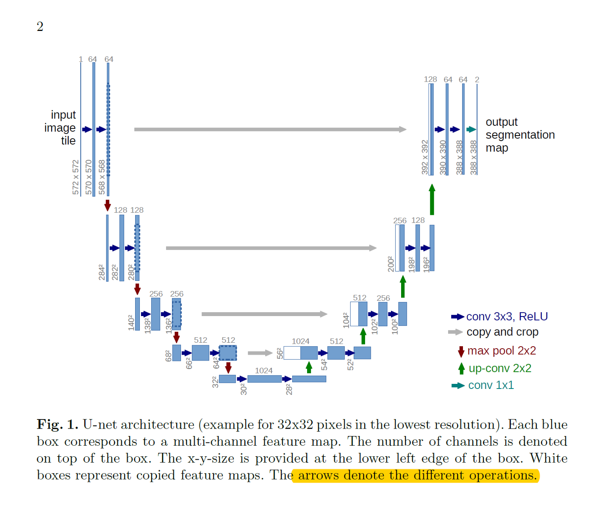
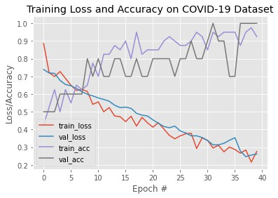

# Bangkit Assessment
A repository for Google Bangkit first Online Assessment

## Team
[Arief Hirmanto](https://github.com/ariefhirmanto)  |      [Dimas Apeco Putra](https://github.com/dispectra) | [Gusti Triandi Winata](https://github.com/sanggusti)
------------------------------------------------------

## Topic
- Covid-19 Chest X-Ray Classification ([dimas_notebook.ipynb](dimas_notebook.ipynb) and [arief_notebook.ipynb](arief_notebook.ipynb))
- U-Net Medical Image Segmentation Approach ([gusti_notebook.ipynb](gusti_notebook.ipynb))

## Problem Framing

We want to know the condition between healthy lungs and lungs from the person who has contracted Covid-19. We would like to know the difference between these two. Our ideal outcome is that we can predict if a person has Covid-19 or not based on his X-Ray lungs image. Based on that, we define our success metrics is the number of X-ray image of lungs from the patient that contracted with Covid-19 properly predicted by our model. Our Key Results (KR) for success metrics are to have the accuracy of our prediction is more than 60%. Our model is deemed failure if our model generate more than 30% false positive or false negative of Covid-19 prediction.

So, our output from model will be the likely of COVID infection and defined as probability value (from 0 to 1). The output from our model is used to help doctor to diagnose whether the patient has COVID-19 or not. If we didn’t use ML in this problem, every time we had X-ray image of patient, the doctor have to examine it manually. Our problem then best framed as prediction which predicts the probability of infection by COVID-19

The concern of the first model is it cannot differentiate the lungs deformation of Pneumonia case and Covid19 Case. 
In this case, we also provide another approach of experimentation using Cellular Level segmentation using U-Net. We add another notebook with experimentation of U-Net in gusti_notebook.ipynb which approaching way of experimentation in cellular level segmentation.
Santen X-Ray Chest dataset is not used since the image are not representing cellular damage, because there is no other data about COVID lung damages available, we used dataset from Data Science Bowl 2018, Nucleus Image to represent how well it do in Medical image problem.

## Approach
For X-Ray Chest Image Classification we use transfer learning of VGG16 and edit the last layer and train it with the Sansten Covid-19 Dataset.

For U-Net we approach with reference of the [paper](https://arxiv.org/abs/1505.04597), preprocess the data of Data Science Bowl 2018, Nucleus Dataset, build the architecture with reference to the paper, design the IoU relations and train the model.

Here are the architecture that are used in U-Net:

## Result
For Chest X-Ray Classification we get results:

For U-Net Image Segmentation we got results:

## Conclusion
For Chest X-Ray Classification the model performs pretty good with accuracy on 92% with 40 epochs.

For U-Net Image Segmentation, the model are proving quite well in Middle Thresholding ratio with 90% Precision even the model are just trained in 10 epochs. This means the model are just need to be reiterated in more epochs and proving the architecture can do well in Image Segmentation
The model works poor in high thresholding ratio. It is tolerable since higher ratio means more noise are segmented which yields more noise.

## Citation
- Adrian Rosebrock, [Detecting COVID-19 in X-ray images with Keras, TensorFlow, and Deep Learning](https://www.pyimagesearch.com/2020/03/16/detecting-covid-19-in-x-ray-images-with-keras-tensorflow-and-deep-learning/)
- Rajeev Courses of Deep Learning and Computer Vision, Udemy, Chapter 19 Medical Image Segmentation
- Kjetil Åmdal-SævikKeras who made the [U-Net starter - LB 0.277](https://www.kaggle.com/keegil/keras-u-net-starter-lb-0-277)
- Jae Duk-Seo [Article](https://medium.com/@SeoJaeDuk/medical-image-segmentation-part-1-unet-convolutional-networks-with-interactive-code-d07231eb29bf) about U-Net